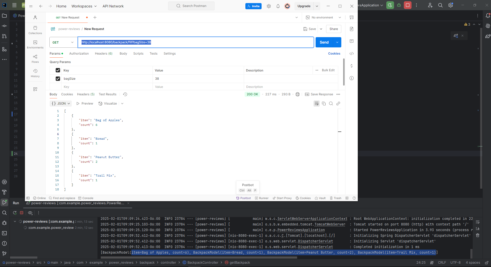

# backpack-filler-javaSpringBoot

README.md

Thanks for taking the time to interview me!

I solved this problem by building a REST API microservice. I used Java, Spring Boot, and Gradle.
Java 17 is required to run this project and spin up the API.

To test out my solution, you'll need to start up the API and send a GET request to http://localhost:8080/backpack/fill?bagSize=38

Set the bagSize RequestParam to whatever number you want.

Project Running Tips: I recommend opening the project folder in InteliJ, then using InteliJ's Run / Play button on the PowerReviewsApplication.java.

And to run the tests in BackpackControllerTest.java, run this command './gradlew test'.

See PNG screenshots in the root directory to invoke API:

